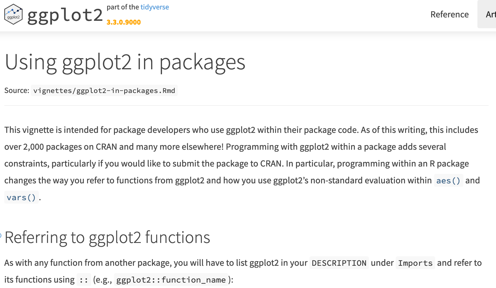
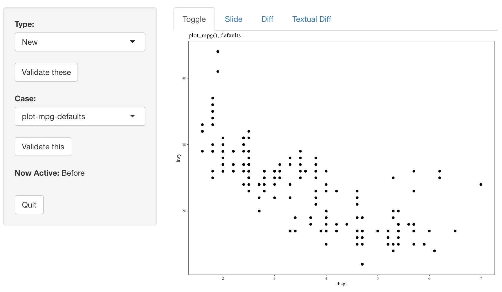

class: center, middle, inverse

```{r setup, include=FALSE}
library(ggplot2)

options(htmltools.dir.version = FALSE)
knitr::opts_chunk$set(echo = TRUE, dpi = 300, fig.height = 2)
```

# It all started with a reverse dependency check...

```{r, eval=FALSE, include=FALSE}
# number of packages that depend on ggplot2
nrow(
  dplyr::filter(
    tibble::as_tibble(available.packages()),
    stringr::str_detect(Depends, "ggplot2") | 
      stringr::str_detect(Imports, "ggplot2") | 
      stringr::str_detect(Suggests, "ggplot2")
  )
)
```

---
class: center, middle



(vignette at [ggplot2.tidyverse.org](https://ggplot2.tidyverse.org/dev/articles/ggplot2-in-packages.html))

---
class: center, middle, inverse

# Programming with ggplot2

---

<!-- doesn't work in the demo but works in other browsers -->
<iframe class="shinyapp" src="https://paleolimbot.shinyapps.io/ggpkg_demo/"></iframe>

---

```{r}
library(ggplot2)
ggplot(mpg) +
  geom_point(aes(displ, hwy, colour = class)) +
  facet_wrap(vars(drv))
```

---

# Programming with ggplot2

```{r}
colour_var <- "class"
facet_var <- "drv"
```

---

# Programming with ggplot2

```{r}
colour_var <- "class"
facet_var <- "drv"
```

Mappings and facet specifications use tidy evaluation:

```{r, fig.show='hide'}
ggplot(mpg) +
  geom_point(aes(displ, hwy, colour = class)) +
  facet_wrap(vars(drv))
```

---

# Programming with ggplot2

```{r}
colour_var <- "class"
facet_var <- "drv"
```

Mappings and facet specifications use tidy evaluation:

```{r, fig.show = 'hide'}
ggplot(mpg) +
  geom_point(aes(displ, hwy, colour = .data[[colour_var]])) +
  facet_wrap(vars(.data[[facet_var]]))
```

---

# Programming with ggplot2

.hidden[

```{r}
colour_var <- "class"
```


Mappings and facet specifications use tidy evaluation:

]

```{r}
plot_mpg <- function(colour_var = "class", facet_var = "drv") {
  ggplot(mpg) +
    geom_point(aes(displ, hwy, colour = .data[[colour_var]])) +
    facet_wrap(vars(.data[[facet_var]]))
}
```

---

# Programming with ggplot2

```{r}
plot_mpg("class", "drv")
```

---

# Programming with ggplot2

```{r, error=TRUE}
plot_mpg <- function(colour_var = "class", facet_var = "drv") {
  ggplot(mpg) +
    geom_point(aes(displ, hwy, colour = .data[[colour_var]])) +
    facet_wrap(vars(.data[[facet_var]]))
}

plot_mpg(NULL, "drv")
```

---

# Programming with ggplot2

```{r, error=TRUE}
plot_mpg <- function(colour_var = "class", facet_var = "drv") {
  mapping <- aes(displ, hwy, colour = .data[[colour_var]])
  
  ggplot(mpg) +
    geom_point(mapping) +
    facet_wrap(vars(.data[[facet_var]]))
}

plot_mpg(NULL, "drv")
```

---

# Programming with ggplot2

```{r}
plot_mpg <- function(colour_var = "class", facet_var = "drv") {
  mapping <- aes(displ, hwy, colour = .data[[colour_var]])
  
  if (is.null(colour_var)) {
    mapping$colour <- NULL
  }
  
  ggplot(mpg) +
    geom_point(mapping) +
    facet_wrap(vars(.data[[facet_var]]))
}

plot_mpg(NULL, "drv")
```


---

# Programming with ggplot2

```{r, error = TRUE}
plot_mpg <- function(colour_var = "class", facet_var = "drv") {
  mapping <- aes(displ, hwy, colour = .data[[colour_var]])
  
  if (is.null(colour_var)) {
    mapping$colour <- NULL
  }
  
  ggplot(mpg) +
    geom_point(mapping) +
    facet_wrap(vars(.data[[facet_var]]))
}

plot_mpg(NULL, NULL)
```

---

# Programming with ggplot2

```{r, error = TRUE}
plot_mpg <- function(colour_var = "class", facet_var = "drv") {
  mapping <- aes(displ, hwy, colour = .data[[colour_var]])
  
  if (is.null(colour_var)) {
    mapping$colour <- NULL
  }
  
  facet <- facet_wrap(vars(.data[[facet_var]]))
  
  ggplot(mpg) +
    geom_point(mapping) +
    facet
}

plot_mpg(NULL, NULL)
```

---

# Programming with ggplot2

```{r}
plot_mpg <- function(colour_var = "class", facet_var = "drv") {
  mapping <- aes(displ, hwy, colour = .data[[colour_var]])
  
  if (is.null(colour_var)) {
    mapping$colour <- NULL
  }
  
  if (is.null(facet_var)) {
    facet <- NULL
  } else {
    facet <- facet_wrap(vars(.data[[facet_var]]))
  }
  
  ggplot(mpg) +
    geom_point(mapping) +
    facet
}
```

---

```{r, fig.height=5}
plot_mpg(NULL, NULL)
```

---

```{r, fig.height=5}
plot_mpg("class", NULL)
```

---

# Programming with ggplot2:

`aes(aesthetic = NULL)` is identical to `aes()`

- Use to conditionally map a variable with minimal repeated code.
- Use `!!sym("column name as string")` to convert a string to an expression that can be used within `aes()`.

`ggplot() + NULL` is identical to `ggplot()`

- Use to conditionally add a layer/facet/scale to a plot

`ggplot() + item1 + item2` is identical to `ggplot() + list(item1, item2)`

- Use to conditionally add more than one item to a plot

If you need more than one `ggplot()` call in a function, it's a good indication that you need more than one function.

---
class: center, middle, inverse

# Use <br/><br/> `.data[["variable_name"]]` <br/><br/> within <br/><br/> `aes()` and/or `vars()`

---
class: center, middle, inverse

# `ggplot(...) + NULL` <br/><br/> is identical to <br/><br/> `ggplot(...)` <br/><br/> Use it to conditinally add an item to a plot!

---
class: center, middle, inverse

# `ggplot(...) + item1 + item2` <br/><br/> is identical to <br/><br/> `ggplot(...) + list(item1, item2)` <br/><br/> Use it to conditinally more than one item to a plot!

---

# Introducing...the {plotmpg} package!

```{r, include=FALSE}
rm(plot_mpg)
```

```{r}
library(plotmpg)
plot_mpg("class", "drv")
```

---
class: center, middle, inverse

# Does your package need a plot function?

# (consider documentation instead)

---

# Using ggplot2 in packages: namespacing

```{r}


plot_mpg <- function(colour_var = "class", facet_var = "drv") {
  mapping <- aes(displ, hwy, colour = .data[[colour_var]])
  
  if (is.null(colour_var)) {
    mapping$colour <- NULL
  }
  
  if (is.null(facet_var)) {
    facet <- NULL
  } else {
    facet <- facet_wrap(vars(.data[[facet_var]]))
  }
  
  ggplot(mpg) +
    geom_point(mapping) +
    facet
}
```

---

# Using ggplot2 in packages: namespacing

```{r}
#' @importFrom ggplot2 ggplot aes vars facet_wrap geom_point labs
#' @importFrom rlang .data
plot_mpg <- function(colour_var = "class", facet_var = "drv") {
  mapping <- aes(displ, hwy, colour = .data[[colour_var]])
  
  if (is.null(colour_var)) {
    mapping$colour <- NULL
  }
  
  if (is.null(facet_var)) {
    facet <- NULL
  } else {
    facet <- facet_wrap(vars(.data[[facet_var]]))
  }
  
  ggplot(ggplot2::mpg) +
    geom_point(mapping) +
    facet
}
```

---

# Using ggplot2 in packages: undefined variables

```
── R CMD check results ──────────── plotmpg 0.0.0.9000 ────
Duration: 25.2s

> checking R code for possible problems ... NOTE
  plot_mpg: no visible binding for global variable ‘displ’
  plot_mpg: no visible binding for global variable ‘hwy’
  Undefined global functions or variables:
    displ hwy

0 errors ✓ | 0 warnings ✓ | 1 note x
```

---

# Using ggplot2 in packages: undefined variables

```{r}
#' @importFrom ggplot2 ggplot aes vars facet_wrap geom_point labs
#' @importFrom rlang .data
plot_mpg <- function(colour_var = "class", facet_var = "drv") {
  mapping <- aes(displ, hwy, colour = .data[[colour_var]])
  
  if (is.null(colour_var)) {
    mapping$colour <- NULL
  }
  
  if (is.null(facet_var)) {
    facet <- NULL
  } else {
    facet <- facet_wrap(vars(.data[[facet_var]]))
  }
  
  ggplot(ggplot2::mpg) +
    geom_point(mapping) +
    facet
}
```

---

# Using ggplot2 in packages: undefined variables

```{r}
#' @importFrom ggplot2 ggplot aes vars facet_wrap geom_point labs
#' @importFrom rlang .data
plot_mpg <- function(colour_var = "class", facet_var = "drv") {
  mapping <- aes(.data$displ, .data$hwy, colour = .data[[colour_var]])
  
  if (is.null(colour_var)) {
    mapping$colour <- NULL
  }
  
  if (is.null(facet_var)) {
    facet <- NULL
  } else {
    facet <- facet_wrap(vars(.data[[facet_var]]))
  }
  
  ggplot(ggplot2::mpg) +
    geom_point(mapping) +
    facet
}
```

---

# Using ggplot2 in packages: undefined variables

```
── R CMD check results ──────────── plotmpg 0.0.0.9000 ────
Duration: 26.8s

0 errors ✓ | 0 warnings ✓ | 0 notes ✓
```

---

# Using ggplot2 in packages: testing

Set up testing, install [vdiffr](http://vdiffr.r-lib.org/):

``` r
# install.packages("vdiffr")
usethis::use_test("plot-mpg")
usethis::use_package("vdiffr", "Suggests")
```

``` r
# currently, vdiffr requires a context at the top of each file
context("test-plot-mpg")

test_that("plot_mpg() works", {
  vdiffr::expect_doppelganger(
    "plot_mpg(), defaults",
    plot_mpg()
  )
})
```

---

# Using ggplot2 in packages: testing

``` r
vdiffr::manage_cases()
## Running testthat to collect visual cases
## 
##   N = New visual case
##   X = Failed doppelganger
##   o = Successful doppelganger
## 
## N
## Loading required package: shiny
## 
## Listening on http://127.0.0.1:4164
```

---

# Using ggplot2 in packages: testing



---
class: center, middle, inverse

# Namespace using <br/><br/> `ggplot::function()` <br/><br/> and/or <br/><br/> `#' @importFrom ggplot2 function`

---
class: center, middle, inverse

# Avoid check problems by using <br/><br/> `.data$var` <br/><br/> within `aes()` and `vars()`

---
class: center, middle, inverse

# Test using {vdiffr}!

---
class: center, middle

# Best practices for programming with ggplot2


Slides: [fishandwhistle.net/slides/rstudioconf2020](https://fishandwhistle.net/slides/rstudioconf2020)

Code: [github.com/paleolimbot/rstudioconf2020](https://github.com/paleolimbot/rstudioconf2020)

Vignette: [Using ggplot2 in packages](https://ggplot2.tidyverse.org/dev/articles/ggplot2-in-packages.html)

@paleolimbot on [Twitter](https://twitter.com/paleolimbot) and [GitHub](https://github.com/paleolimbot)
